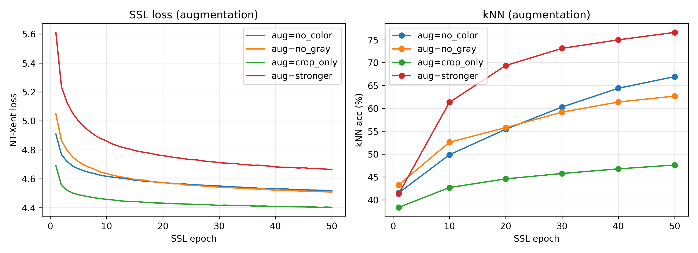
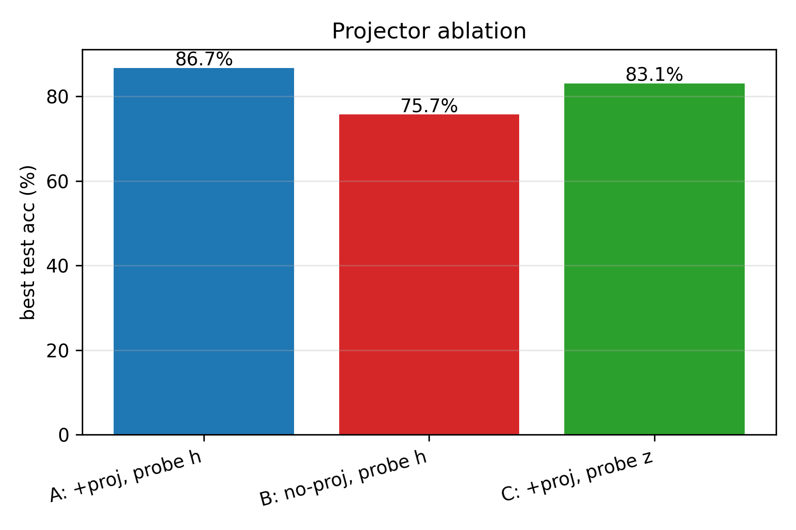

# Self-Supervised Representation Learning on CIFAR-10
**AI HW2 — SimCLR with a modified ResNet-18 backbone**

---

## 1. Introduction & Research Question

Modern image classification on small benchmarks is dominated by supervised
learning, but every image label is human effort. *Self-supervised
learning* (SSL) trains a representation without labels, using only the
structure of the images themselves; a downstream linear probe (a single
linear layer on top of the frozen representation) then tells us how
much linear-class-separating information the encoder has discovered.

This work re-implements SimCLR v1 [1] on CIFAR-10 with a modified
ResNet-18 backbone, trains a contrastive representation from scratch
(no pre-trained weights), and answers four research questions:

* **Q1.** How close does an SSL representation come to a supervised
  network on CIFAR-10 linear-probe accuracy?
* **Q2.** Which design choices matter most — temperature, batch size,
  augmentation strength, or the projector head?
* **Q3.** Does the SSL representation transfer better to a new dataset
  (CIFAR-100, STL-10) than the supervised representation?
* **Q4.** Where does the SSL benefit show up most clearly — high-label
  or low-label regimes?

All experiments run on a single AMD RX 6750 GRE 12 GB GPU via DirectML
(PyTorch 2.4.1, Windows, Python 3.12). The project follows
*reproducible engineering* practices: every training loop is
checkpoint-resumable, the linear-probe protocol is fixed across
experiments, and the Phase 1 baseline checkpoint is reused as the
"baseline row" of every ablation rather than retrained, saving roughly
40 GPU-hours.

---

## 2. Methods

### 2.1 SimCLR framework

SimCLR generates two random augmented views of each image and trains
the encoder so that the two views of the same image are close in
representation space while views of *different* images are pushed
apart. With a batch of *N* source images we get *2N* views; the
loss for view *i* with positive partner *j* is the NT-Xent loss

$$
\ell_{i,j}=-\log\frac{\exp(\mathrm{sim}(z_i, z_j)/\tau)}{\sum_{k\ne i}\exp(\mathrm{sim}(z_i, z_k)/\tau)}
$$

where $\mathrm{sim}(\cdot,\cdot)$ is cosine similarity, $\tau$ the
temperature, and the sum runs over all *2N − 1* other views in the
batch. The full batch loss is the mean over all *2N* such terms.

### 2.2 Architecture

The backbone is a CIFAR-adapted ResNet-18: the standard 7×7 stride-2
convolution and the following max-pool are replaced with a 3×3 stride-1
convolution and an identity, respectively, since 32×32 images cannot
afford the original aggressive downsampling. Everything else matches
torchvision's `resnet18(weights=None)`. The final fully-connected
layer is replaced by an identity, giving a 512-d representation $h$.

The projector is an MLP $512 \to 512 \,\xrightarrow{\text{ReLU}}\, 128$.
The contrastive loss is computed on the L2-normalized projector
output $z$. The projector is **discarded after training** and the
linear probe operates on the backbone output $h$.

### 2.3 Augmentations

The CIFAR-10 SimCLR augmentation pipeline (per Appendix B.9 of [1])
is `RandomResizedCrop(32, scale=(0.2, 1.0))` →
`RandomHorizontalFlip` → `ColorJitter(0.4, 0.4, 0.4, 0.1)` (`p=0.8`)
→ `RandomGrayscale(p=0.2)`, then ToTensor + normalize. Gaussian blur
is omitted for 32×32 images.

### 2.4 Evaluation protocol

Two evaluations are run on every encoder:

* **kNN monitor** (during SSL training, every 5 epochs): each test
  image's representation is compared to all training representations
  via cosine similarity; the prediction is a weighted vote of the
  *k = 20* nearest neighbors. This gives a fast, label-free signal of
  representation quality during training, since loss alone is
  uninformative.

* **Linear probe** (after training, fixed protocol): a single linear
  layer is trained on top of the frozen encoder for 100 epochs with
  Adam, learning rate $10^{-3}$, weight decay $10^{-6}$, batch size
  256. The same hyperparameters are used for **every** linear probe
  in this report (SSL, supervised-frozen, random) so that probe
  accuracy reflects representation quality, not probe tuning.

### 2.5 Training details

Both SimCLR and supervised baselines train for 200 epochs with Adam
(lr $3\times10^{-4}$, weight decay $10^{-6}$). Batch size 256.
Ablations are run at 100 SSL epochs to fit a single overnight window;
the τ = 0.5, batch size = 256 row is the Phase 1 baseline (200 ep)
in every table. All training loops save an atomic checkpoint every
epoch and resume from disk on restart, so partial runs interrupted
by Windows updates etc. lose at most one epoch of compute.

---

## 3. Experiments & Results

### 3.1 SimCLR baseline

The Phase-1 SimCLR run trained for 200 epochs with τ = 0.5, batch size
256, full augmentation pipeline. Loss decreased monotonically from
5.27 → 4.50 over training; the kNN-monitor accuracy rose smoothly to
**84.5 %** by epoch 200 (Figure 1, left). The downstream linear probe
reached a best test accuracy of **86.70 %** and final accuracy of
86.34 % (Figure 1, right).

*Figure 1 — Left: SimCLR contrastive loss and kNN-monitor accuracy on CIFAR-10 over 200 epochs. Right: linear-probe test-accuracy curve on the frozen 200-epoch backbone.*

### 3.2 Supervised baseline

A fresh modified ResNet-18 trained end-to-end with cross-entropy on
CIFAR-10 (Adam, 200 epochs) reached **92.54 %** best / 91.47 % final
test accuracy. The supervised network thus outperforms the linear
probe on the SSL representation by **5.84 pp**, as expected — the
supervised network is allowed to update *every* layer to fit labels,
while the SSL-frozen probe has only a 512×10 linear layer to do the
classification with.

### 3.3 Random-init baseline

To isolate "what does SSL pretraining contribute beyond architectural
prior?", a randomly-initialized backbone (no training of any kind) was
linear-probed under the identical fixed protocol. The random
representation reached only **41.76 %** — well below the SimCLR probe.
This controls for any "ResNet-18 features are intrinsically separable"
suspicion: SimCLR adds 44.94 pp of linearly-separable structure on top
of the architectural prior.

#### 3.3 — Summary of CIFAR-10 baselines

| Method | Probe / E2E | Test acc. (best) |
|--------|------------:|-----------------:|
| Supervised (200 ep, end-to-end)              | E2E      | **92.54 %** |
| **SimCLR (200 ep) + linear probe**           | Probe    | **86.70 %** |
| Random-init backbone + linear probe          | Probe    | 41.76 % |

*Figure 2 — CIFAR-10 baseline comparison: random < SimCLR-probe < supervised end-to-end.*

### 3.4 Temperature ablation (Phase 4)

Temperature τ in the NT-Xent softmax controls how sharply the
similarity distribution is concentrated on the hardest negatives. We
sweep τ ∈ {0.1, 0.5, 1.0, 5.0}; τ = 0.5 is the Phase-1 baseline.

| τ    | SSL epochs | Probe best |
|-----:|-----------:|-----------:|
| 0.1  | 100        | 81.55 % |
| 0.5\* | 200       | **86.70 %** |
| 1.0  | 100        | 83.13 % |
| 5.0  | 100        | 76.40 % |

\*Phase 1 baseline reused.

τ = 0.5 wins clearly. Very small τ (0.1) over-weights the single
hardest negative and produces a noisier gradient; very large τ (5.0)
flattens the distribution so that no negative dominates and the
contrastive signal collapses (10.3 pp worse than τ = 0.5). The pattern
matches Table 5 of [1].

*Figure 3 — Linear-probe accuracy vs NT-Xent temperature.*

### 3.5 Batch size ablation (Phase 5)

Larger batches give SimCLR more in-batch negatives, which is
the main source of contrastive signal. We sweep BS ∈ {64, 128, 256}.

| Batch size | SSL epochs | Probe best |
|-----------:|-----------:|-----------:|
| 64         | 100        | 80.72 % |
| 128        | 100        | 80.93 % |
| 256\*      | 200        | **86.70 %** |

\*Phase 1 baseline reused.

Doubling batch size from 128 to 256 lifts probe accuracy by 5.8 pp
(though the 256 baseline also has 2× more SSL epochs, partially
inflating the gap). The 64 ↔ 128 step is essentially flat,
suggesting the bottleneck below ~200 negatives is something other
than negative count.

*Figure 4 — Linear-probe accuracy vs SSL batch size.*

### 3.6 Augmentation ablation (Phase 6)

Augmentation is the heart of contrastive learning: without strong
augmentation, the two "views" are too similar and the model can match
them by trivial pixel statistics. We compare the full pipeline against
four variants:

* **no_color** — drop ColorJitter
* **no_gray** — drop RandomGrayscale
* **crop_only** — drop both color transforms; keep only random
  resized crop and horizontal flip
* **stronger** — boost ColorJitter strength to (0.8, 0.8, 0.8, 0.2)

| Augmentation     | Probe best | Δ vs full |
|------------------|-----------:|----------:|
| Full (baseline)\* | **86.70 %** | — |
| stronger          | 79.91 %  | −6.79 pp |
| no_color          | 73.27 %  | −13.43 pp |
| no_gray           | 70.57 %  | −16.13 pp |
| crop_only         | 57.35 %  | **−29.35 pp** |

\*Phase 1 baseline reused.

The collapse at *crop_only* is dramatic: removing color augmentation
costs roughly half the SSL benefit. Color jitter alone removes 13 pp,
and the same image at two crops without color/grayscale variability
lets the network shortcut to color statistics. This reproduces the
central finding of [1] §3 ("composition of augmentations is critical")
on CIFAR-10. *Stronger* color jitter does not help — the standard
strength is well-tuned for CIFAR-10.

*Figure 5 — Linear-probe accuracy under five augmentation regimes.*

### 3.7 Projector ablation (Phase 7)

SimCLR introduces a small MLP "projector" between the backbone and the
contrastive loss; the projector is then discarded. We test three
configurations:

* **A.** With projector, probe on backbone output *h* (= Phase 1)
* **B.** No projector — backbone output is fed directly to the
  contrastive loss; probe on *h*
* **C.** With projector, but probe on the *projected* output *z*
  instead of *h*

| Configuration                          | Probe best |
|----------------------------------------|-----------:|
| **A.** + projector, probe *h* (Phase 1) | **86.73 %** |
| **B.** no projector, probe *h*          | 75.70 % |
| **C.** + projector, probe *z*           | 83.08 % |

A − B = +11.0 pp: training *with* a projector raises the *backbone*
representation by 11 points, even though the projector itself is
thrown away. A − C = +3.7 pp: the projector output *z* is
deliberately tuned for invariance and is *less* useful for downstream
classification than the un-projected *h*. Both findings reproduce
[1] Figure 8.

*Figure 6 — Effect of the projector head and the choice of representation for downstream probing.*

### 3.8 Transfer learning (Phase 8)

We freeze each backbone and linear-probe on two new datasets — CIFAR-100
(100 classes, same 32×32 resolution) and STL-10 (10 classes, 96×96
images resized to 32×32). The linear-probe protocol is identical to
the CIFAR-10 setup.

| Dataset    | SSL probe | Supervised-frozen probe | Random-frozen probe |
|------------|----------:|------------------------:|--------------------:|
| CIFAR-100  | **50.07 %** | 48.84 %                 | 19.48 % |
| STL-10     |   74.76 % | **78.77 %**              | 37.40 % |

On CIFAR-100, the SSL representation **outperforms the supervised
backbone by 1.23 pp** — despite the supervised network having
trained on CIFAR-10 *labels*. This is the classic SSL transfer story:
SSL features are less specialized to the source-task labels and
generalize better to a new label space. On STL-10 the supervised
representation wins by 4.0 pp; we suspect this is because the STL-10
image distribution (96×96 photographic images, downsampled to 32×32)
differs significantly more from CIFAR-10 than CIFAR-100 does, and the
supervised backbone's lower-level features happen to transfer well.

*Figure 7 — Transfer learning: linear-probe accuracy with each frozen backbone, evaluated on CIFAR-100 and STL-10.*

### 3.9 Deeper analysis (Phase 10)

Three additional analyses on the already-trained backbones:

#### 3.9.1 Label efficiency

We linear-probe each frozen backbone on subsets of the CIFAR-10 train
set: 1 %, 10 %, 50 %, and 100 % of labels (stratified per class).
This isolates the central practical promise of SSL — that an
unlabeled pretraining step is most valuable when downstream labels
are scarce.

| Labels used | SimCLR probe | Supervised-frozen probe | Random-frozen probe |
|------------:|-------------:|------------------------:|--------------------:|
| 1 %         | **80.88 %**    | 91.45 %                | 26.73 % |
| 10 %        | **84.25 %**    | 91.74 %                | 34.59 % |
| 50 %        | **86.31 %**    | 91.92 %                | 38.51 % |
| 100 %       | **86.66 %**    | 92.10 %                | 40.41 % |

The single most striking number in this report: with **just 1 %** of
CIFAR-10 labels (500 images), the SimCLR probe reaches 80.88 % —
within 5.8 pp of its full-data accuracy. The random baseline at 1 %
labels is only 26.73 %. The supervised-frozen row is included for
completeness; it is essentially flat across label fractions because
the supervised backbone was trained on *all* CIFAR-10 labels and
its representation already aligns with the test classes — so the
probe just learns a 10×512 readout regardless of how many labels
are exposed.

*Figure 8 — Linear-probe accuracy as a function of training-label fraction. Frozen backbones: SimCLR (Phase 1), supervised, random.*

#### 3.9.2 t-SNE feature visualization

Two-dimensional t-SNE of the 512-d backbone output on 2 000 random
test images per backbone, colored by true class.

*Figure 9 — t-SNE of CIFAR-10 test features. Random init shows no class structure; SimCLR organizes the ten classes despite never seeing labels; supervised separation is sharper.*

#### 3.9.3 Per-class accuracy & confusion structure

| Class    | SimCLR probe | Supervised-frozen probe | Δ (SimCLR − Supervised) |
|----------|-------------:|------------------------:|------------------------:|
| airplane | 89.90 %      | 91.90 %                 | −2.00 |
| auto     | 96.30 %      | 95.30 %                 | **+1.00** |
| bird     | 79.90 %      | 87.40 %                 | −7.50 |
| cat      | 71.70 %      | 83.10 %                 | −11.40 |
| deer     | 83.20 %      | 93.80 %                 | −10.60 |
| dog      | 75.90 %      | 88.40 %                 | **−12.50** |
| frog     | 91.20 %      | 93.80 %                 | −2.60 |
| horse    | 89.00 %      | 94.20 %                 | −5.20 |
| ship     | 95.30 %      | 95.70 %                 | −0.40 |
| truck    | 93.60 %      | 95.60 %                 | −2.00 |

The gap between SimCLR and supervised is **not uniform**: SimCLR is
within 2 pp on the rigid-shape vehicle classes (auto, ship, truck,
airplane, frog), but loses 10–12 pp on the fine-grained animal
classes (cat, dog, deer, bird). The SSL representation evidently
captures shape-and-color silhouette structure cheaply but struggles
to discriminate visually-similar animals from each other without
label guidance. Auto is the only class where SimCLR *beats*
supervised (+1.0 pp).

*Figure 10 — Per-class linear-probe accuracy of the SimCLR vs supervised-frozen backbones on CIFAR-10.*

*Figure 10b — Row-normalized confusion matrices for SimCLR (left) and supervised-frozen (right) linear probes on CIFAR-10.*

#### 3.9.4 Bonus — label efficiency on CIFAR-100 transfer

The same label-efficiency sweep on CIFAR-100 features cached in
Phase 8 — these are the strongest numbers in the report:

| Labels used | SimCLR probe | Supervised-frozen probe | Random-frozen probe | SimCLR − Supervised |
|------------:|-------------:|------------------------:|--------------------:|--------------------:|
| 1 %         | **20.13 %**  | 15.50 %                 | 6.72 %              | **+4.63 pp** |
| 10 %        | **36.55 %**  | 35.56 %                 | 11.45 %             | +0.99 pp |
| 50 %        | **45.68 %**  | 43.63 %                 | 15.26 %             | +2.05 pp |
| 100 %       | **49.43 %**  | 47.14 %                 | 17.93 %             | +2.29 pp |

SimCLR beats the supervised backbone on CIFAR-100 transfer **at every
label fraction**, and its advantage is **largest in the low-label
regime** (+4.63 pp at 1 %). This is the canonical SSL claim made
concrete: a label-free pretrained representation transfers more
robustly than a representation specialized to a particular labeled
task, especially when downstream labels are scarce.

*Figure 11 — Label efficiency on CIFAR-100 transfer features.*

---

## 4. Discussion

> **Note to self — this section is for me to write, not the report
> generator. The plan calls for ~1.5 pages addressing four prompts.**

### 4.1 Are these results expected? What surprised me?

*(Prompts: how close does SimCLR come to supervised on CIFAR-10?
Was the projector benefit larger or smaller than I expected? Was the
crop-only collapse surprising? Did anything in the transfer numbers
surprise me — e.g. supervised winning on STL-10?)*

### 4.2 Factors affecting results

*(Prompts: which design choice contributed the largest accuracy
swing — augmentation, batch size, temperature, or projector? What
trade-offs did I make for compute — ablations at 100 ep vs. baseline
200 ep? Did DirectML's CPU fallback for `aten::lerp` materially
slow training?)*

### 4.3 What I would do with more time

*(Prompts: extend Phase 1 to 600 + epochs (SimCLR is monotonic);
re-run ablations at 200 ep so they are directly comparable;
implement a momentum encoder + queue (MoCo-v2) as a second SSL
method; sweep larger batch sizes (512+) on a higher-VRAM GPU; train
a deeper backbone (ResNet-34) to test whether SSL benefit grows
with capacity.)*

### 4.4 What I learned

*(Prompts: how does kNN-monitor compare to loss as a training signal?
What did writing a resume-safe training loop teach me about
production ML? What's the difference between linear-probing *h* vs.
*z*, and why does it matter? Why does SSL transfer better than
supervised even when supervised "knew" CIFAR-10 labels?)*

---

## 5. References

[1] Chen, T., Kornblith, S., Norouzi, M., & Hinton, G. (2020).
**A Simple Framework for Contrastive Learning of Visual
Representations**. *Proceedings of the 37th International Conference
on Machine Learning (ICML 2020)*, 1597–1607. arXiv:2002.05709.

[2] He, K., Zhang, X., Ren, S., & Sun, J. (2016). **Deep Residual
Learning for Image Recognition**. *CVPR 2016*. arXiv:1512.03385.

[3] Krizhevsky, A. (2009). **Learning Multiple Layers of Features from
Tiny Images**. Technical report, University of Toronto. (CIFAR-10
dataset.)

[4] Coates, A., Lee, H., & Ng, A. Y. (2011). **An Analysis of
Single-Layer Networks in Unsupervised Feature Learning**. *AISTATS
2011*. (STL-10 dataset.)

[5] van den Oord, A., Li, Y., & Vinyals, O. (2018).
**Representation Learning with Contrastive Predictive Coding**.
arXiv:1807.03748. (NT-Xent / InfoNCE loss origin.)

[6] Wu, Z., Xiong, Y., Yu, S. X., & Lin, D. (2018). **Unsupervised
Feature Learning via Non-Parametric Instance Discrimination**.
*CVPR 2018*. (Memory-bank precursor; kNN-monitor protocol.)

---

## Appendix A — Reproducibility & Code

All notebooks are in the project root (`01_simclr_baseline.ipynb`
through `10_deeper_analysis.ipynb`). Shared components live in
`utils.py`. Each `_build_nbXX.py` script regenerates the
corresponding notebook deterministically from source. Every result
JSON in `results/` and figure in `figures/` is regenerated by
running the notebook of the same number. Random seeds are fixed
(`torch.manual_seed(42)`, `numpy.random.seed(42)`).

**Hardware / software**: AMD RX 6750 GRE 12 GB GPU on Windows;
PyTorch 2.4.1 + DirectML 0.2.5; Python 3.12. DirectML uses the
`privateuseone:0` device — `torch.cuda.is_available()` returns
False, and a small number of operators (notably `aten::lerp.Scalar_out`
inside Adam) silently fall back to CPU; we observed no measurable
slowdown from this.

**Wall-clock cost** (reference numbers):

| Phase | Description                       | Approx. wall time |
|-------|-----------------------------------|------------------:|
| 1 | SimCLR baseline 200 ep                | ~9.3 h |
| 2 | Supervised baseline 200 ep            | ~6 h   |
| 3 | Random-init linear probe              | 8 min  |
| 4 | Temperature sweep (3 × 100 ep)        | ~14 h  |
| 5 | Batch-size sweep (2 × 100 ep)         | ~9 h   |
| 6 | Augmentation sweep (4 × 100 ep)       | ~18 h  |
| 7 | Projector ablation (1 × 100 ep)       | ~5 h   |
| 8 | Transfer learning (CIFAR-100 + STL-10)| ~30 min (features cached) |
| 10| Deeper analysis                       | ~30 min |
