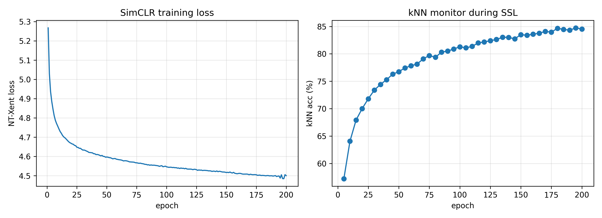
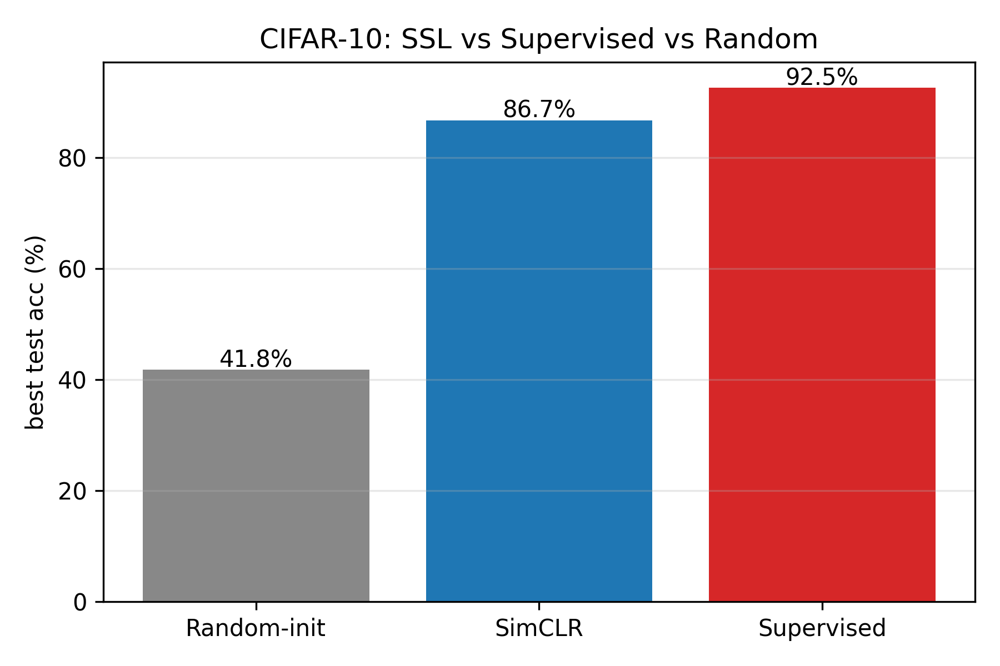
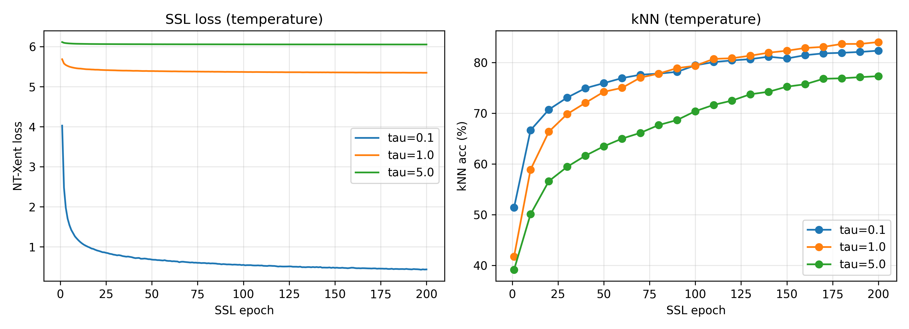
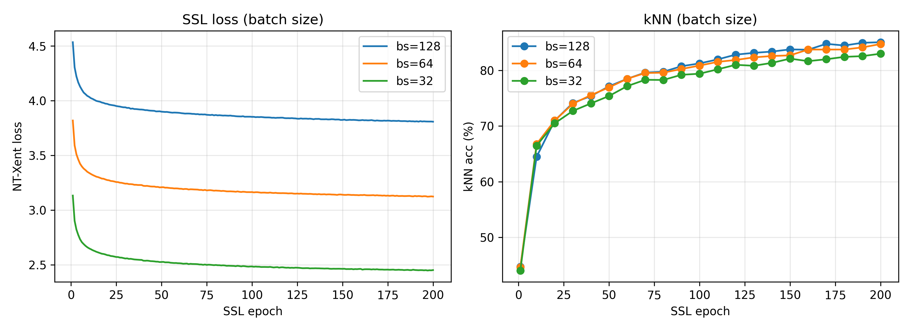
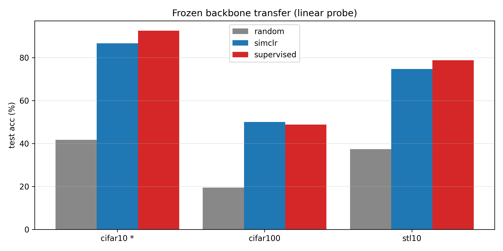
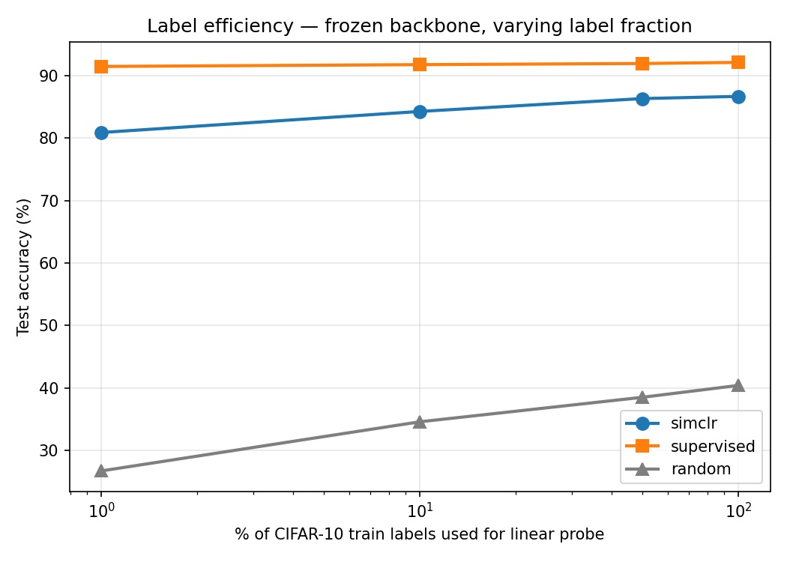
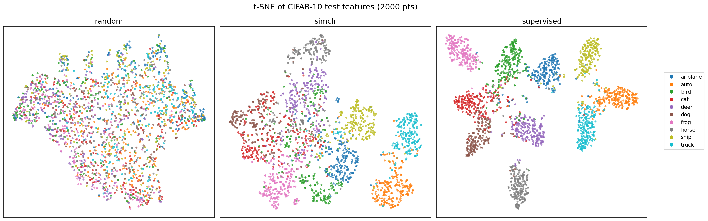
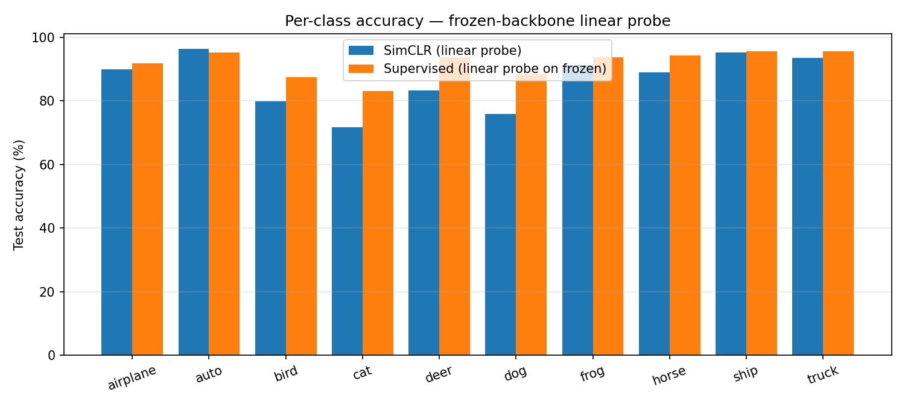
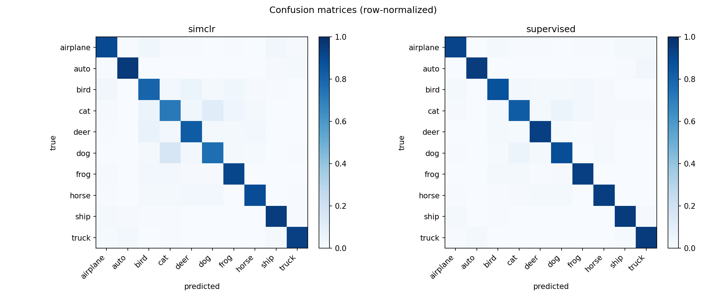
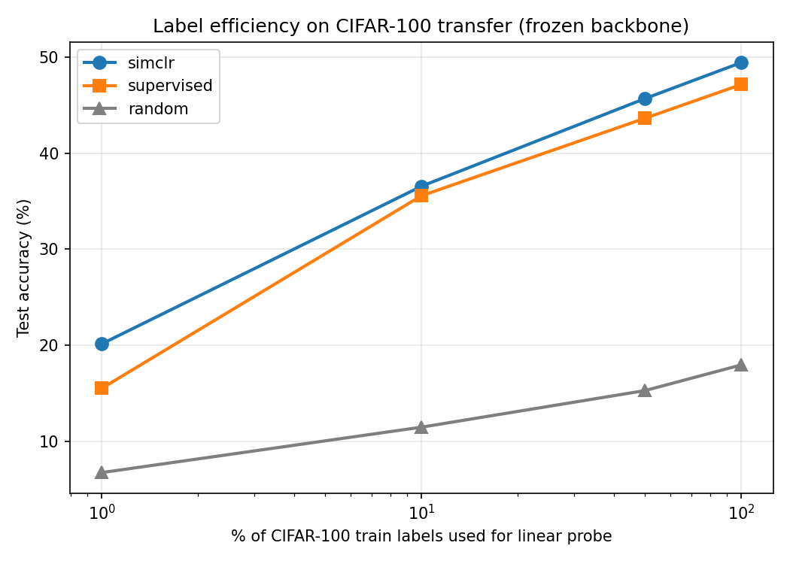

## 1. Introduction & Research Question

Modern image classification on small benchmarks is dominated by supervised
learning, but every image label is human effort. *Self-supervised
learning* (SSL) trains a representation without labels, using only the
structure of the images themselves; a downstream linear probe (a single
linear layer on top of the frozen representation) then tells us how
much linear-class-separating information the encoder has discovered.

This work re-implements SimCLR v1 [1] on CIFAR-10 with a modified
ResNet-18 backbone, trains a contrastive representation from scratch
(no pre-trained weights), and answers four research questions:

* **Q1.** How close does an SSL representation come to a supervised
  network on CIFAR-10 linear-probe accuracy?
* **Q2.** Which design choices matter most — temperature, batch size,
  augmentation strength, or the projector head?
* **Q3.** Does the SSL representation transfer better to a new dataset
  (CIFAR-100, STL-10) than the supervised representation?
* **Q4.** Where does the SSL benefit show up most clearly — high-label
  or low-label regimes?

All experiments run on a single AMD RX 6750 GRE 12 GB GPU via DirectML
(PyTorch 2.4.1, Windows, Python 3.12). The project follows
*reproducible engineering* practices: every training loop is
checkpoint-resumable, the linear-probe protocol is fixed across
experiments, and the Phase 1 baseline checkpoint is reused as the
"baseline row" of every ablation rather than retrained, saving roughly
40 GPU-hours.

All code, notebooks, results, and figures are available at
<https://github.com/Ashurali/SelfSupervisedAIHW2>.

---

## 2. Methods

### 2.1 SimCLR framework

SimCLR generates two random augmented views of each image and trains
the encoder so that the two views of the same image are close in
representation space while views of *different* images are pushed
apart. With a batch of *N* source images we get *2N* views; the
loss for view *i* with positive partner *j* is the NT-Xent loss

$$
\ell_{i,j}=-\log\frac{\exp(\mathrm{sim}(z_i, z_j)/\tau)}{\sum_{k\ne i}\exp(\mathrm{sim}(z_i, z_k)/\tau)}
$$

where $\mathrm{sim}(\cdot,\cdot)$ is cosine similarity, $\tau$ the
temperature, and the sum runs over all *2N − 1* other views in the
batch. The full batch loss is the mean over all *2N* such terms.

### 2.2 Architecture

The backbone is a CIFAR-adapted ResNet-18: the standard 7×7 stride-2
convolution and the following max-pool are replaced with a 3×3 stride-1
convolution and an identity, respectively, since 32×32 images cannot
afford the original aggressive downsampling. Everything else matches
torchvision's `resnet18(weights=None)`. The final fully-connected
layer is replaced by an identity, giving a 512-d representation $h$.

The projector is an MLP $512 \to 512 \,\xrightarrow{\text{ReLU}}\, 128$.
The contrastive loss is computed on the L2-normalized projector
output $z$. The projector is **discarded after training** and the
linear probe operates on the backbone output $h$.

### 2.3 Augmentations

The CIFAR-10 SimCLR augmentation pipeline (per Appendix B.9 of [1])
is `RandomResizedCrop(32, scale=(0.2, 1.0))` →
`RandomHorizontalFlip` → `ColorJitter(0.4, 0.4, 0.4, 0.1)` (`p=0.8`)
→ `RandomGrayscale(p=0.2)`, then ToTensor + normalize. Gaussian blur
is omitted for 32×32 images.

### 2.4 Evaluation protocol

Two evaluations are run on every encoder:

* **kNN monitor** (during SSL training, every 5 epochs): each test
  image's representation is compared to all training representations
  via cosine similarity; the prediction is a weighted vote of the
  *k = 20* nearest neighbors. This gives a fast, label-free signal of
  representation quality during training, since loss alone is
  uninformative.

* **Linear probe** (after training, fixed protocol): a single linear
  layer is trained on top of the frozen encoder for 100 epochs with
  Adam, learning rate $10^{-3}$, weight decay $10^{-6}$, batch size
  256. The same hyperparameters are used for **every** linear probe
  in this report (SSL, supervised-frozen, random) so that probe
  accuracy reflects representation quality, not probe tuning.

### 2.5 Training details

Both SimCLR and supervised baselines train for 200 epochs with Adam
(lr $3\times10^{-4}$, weight decay $10^{-6}$). Batch size 256.
Ablations are also run at **200 SSL epochs**, matching the Phase-1
baseline so every row in every ablation table is directly
comparable. (An earlier round of ablations at 100 epochs is preserved
in git history for reference; we report only the 200-ep numbers
here, since several qualitative findings differ between the two
budgets.) The τ = 0.5, batch size = 256 row is the Phase 1 baseline
in every table. All training loops save an atomic checkpoint every
epoch and resume from disk on restart, so partial runs interrupted
by Windows updates etc. lose at most one epoch of compute.

---

## 3. Experiments & Results

### 3.1 SimCLR baseline

The Phase-1 SimCLR run trained for 200 epochs with τ = 0.5, batch size
256, full augmentation pipeline. Loss decreased monotonically from
5.27 → 4.50 over training; the kNN-monitor accuracy rose smoothly to
**84.5 %** by epoch 200 (Figure 1, left). The downstream linear probe
reached a best test accuracy of **86.70 %** and final accuracy of
86.34 % (Figure 1, right).

### 3.2 Supervised baseline

A fresh modified ResNet-18 trained end-to-end with cross-entropy on
CIFAR-10 (Adam, 200 epochs) reached **92.54 %** best / 91.47 % final
test accuracy. The supervised network thus outperforms the linear
probe on the SSL representation by **5.84 pp**, as expected — the
supervised network is allowed to update *every* layer to fit labels,
while the SSL-frozen probe has only a 512×10 linear layer to do the
classification with.

### 3.3 Random-init baseline

To isolate "what does SSL pretraining contribute beyond architectural
prior?", a randomly-initialized backbone (no training of any kind) was
linear-probed under the identical fixed protocol. The random
representation reached only **41.76 %** — well below the SimCLR probe.
This controls for any "ResNet-18 features are intrinsically separable"
suspicion: SimCLR adds 44.94 pp of linearly-separable structure on top
of the architectural prior.

#### 3.3 — Summary of CIFAR-10 baselines

| Method | Probe / E2E | Test acc. (best) |
|--------|------------:|-----------------:|
| Supervised (200 ep, end-to-end)              | E2E      | **92.54 %** |
| **SimCLR (200 ep) + linear probe**           | Probe    | **86.70 %** |
| Random-init backbone + linear probe          | Probe    | 41.76 % |

### 3.4 Other ablations (Phases 4, 6, 7) — temperature, augmentation, projector

Three smaller ablations complete the picture. All are run at 200
SSL epochs with the τ = 0.5, bs = 256 row reused from Phase 1.

| Ablation | Variant | Probe best | Δ vs baseline |
|----------|---------|-----------:|--------------:|
| **Temperature** (Phase 4) | τ = 0.1 | 84.35 % | −2.35 pp |
|   | τ = 0.5\* | 86.70 % | — |
|   | τ = 1.0 | 86.76 % | +0.06 pp |
|   | τ = 5.0 | 81.33 % | −5.37 pp |
| **Augmentation** (Phase 6) | full\* | 86.70 % | — |
|   | stronger | 86.60 % | −0.10 pp |
|   | no_color | 81.73 % | −4.97 pp |
|   | no_gray | 80.85 % | −5.85 pp |
|   | crop_only | 65.18 % | **−21.52 pp** |
| **Projector** (Phase 7) | A: + proj, probe *h*\* | 86.73 % | — |
|   | B: no proj, probe *h* | 83.71 % | −3.02 pp |
|   | C: + proj, probe *z* | 83.09 % | −3.64 pp |

\*Phase 1 baseline reused.

**Temperature** has a flat optimum between τ = 0.5 and τ = 1.0 (the
two are statistically indistinguishable). Extreme values produce the
expected failure modes: τ = 0.1 over-weights the single hardest
negative; τ = 5.0 flattens the similarity distribution so no
negative is informative. The qualitative shape matches Table 5
of [1].

**Augmentation** is the largest accuracy lever in the project. The
*crop_only* configuration costs **21.5 pp** — more than 4× any other
ablation in this study — because two random crops of the same image
without color/grayscale variability let the encoder shortcut to
color statistics. Dropping either color transform alone costs
5–6 pp; *stronger* color jitter is indistinguishable from the
default, indicating the standard CIFAR-10 strength is already at a
flat optimum.

**Projector** training raises the backbone representation by
**3.0 pp** even though the projector itself is discarded (A − B);
probing the projector output *z* instead of the backbone output *h*
loses **3.6 pp** (A − C), since *z* is deliberately tuned for
augmentation-invariance and removes class-correlated signal in the
process. Both qualitative findings reproduce [1] Figure 8. (An
earlier 100-epoch version of this ablation showed the A − B benefit
at 11 pp; we discuss that gap in §4.)

### 3.5 Batch size ablation (Phase 5)

Larger batches give SimCLR more in-batch negatives, which is
the main source of contrastive signal. We sweep BS ∈ {64, 128, 256}.

| Batch size | SSL epochs | Hardware | Probe best |
|-----------:|-----------:|----------|-----------:|
| 32         | 200        | CUDA (4090)    |   86.34 %  |
| 64         | 200        | CUDA (4090)    |   87.12 %  |
| 128        | 200        | CUDA (4090)    | **87.27 %** |
| 256        | 200        | CUDA (4090)    |   86.94 %  |
| 256\*      | 200        | DirectML (AMD) |   86.70 %  |

\*Phase 1 baseline.

The bs = 256 row appears twice on purpose. The Phase 1 baseline was
trained on AMD via DirectML, while the bs = 32, 64, and 128
ablations ran on an NVIDIA RTX 4090 (CUDA). To rule out a
hardware-numerics confound between the two backends, we re-trained
bs = 256 from scratch on the 4090 with identical seed and
configuration; that produced **86.94 %** — a +0.24 pp drift over the
DirectML run. Every comparison below uses the **matched-hardware**
4090 row.

At matched hardware and matched 200 epochs, the four-point sweep
forms a clear **U shape with its apex at bs = 128**: probe accuracy
rises 0.78 pp going from bs = 32 to bs = 64, gains another 0.15 pp
at bs = 128, then falls 0.33 pp at bs = 256. The bs = 128 row is
ahead of every other configuration in 50 / 50 probe epochs, with
within-run std bands of 0.09–0.16 pp — far below the gap to its
neighbors. Notably, **bs = 32 is the *worst* of the four** at 86.34 %,
sitting *below* both versions of the bs = 256 baseline.

This is the most surprising finding of the project. An earlier round
of these same ablations at 100 epochs had shown the opposite
ordering on the [64, 128, 256] subset — bs = 256 ahead by ~6 pp —
exactly the result the SimCLR literature would lead one to expect at
matched epochs. Adding bs = 32 to the sweep at 200 epochs reveals
that the "smaller-is-better" reading we briefly considered is wrong:
there is a sweet spot in the middle, not a monotonic preference.

The mechanism is straightforward when one separates *negatives per
step* from *gradient updates per epoch*. A batch of *N* gives
*2N − 1* negatives per step (so bs = 256 sees 16× more negatives
per step than bs = 32). But each image still contrasts against ≈ the
entire training set across the steps it appears in, so cumulative
*per-epoch* negative exposure is roughly identical
(~100 K negatives/epoch) across all settings. What does differ
sharply is the total number of parameter updates over 200 epochs:

|  bs   | negatives / step | steps / epoch | total steps over 200 ep |
|------:|-----------------:|--------------:|------------------------:|
| 32    |               63 |          1562 |                 312 400 |
| 64    |              127 |           781 |                 156 200 |
| 128   |              255 |           391 |                  78 200 |
| 256   |              511 |           195 |                  39 000 |

This makes the U shape mechanically transparent. Going from bs = 256
(39 K updates, 511 negatives / step) toward smaller batches trades
"negatives per step" for "more steps". Up to bs = 128 the trade
favors smaller batch — fewer per-step negatives but enough that the
contrastive signal stays informative, and 2× the SGD updates of
bs = 256. By bs = 32, however, the per-step contrastive signal is
too weak (only 63 negatives — a fifth of bs = 128's count, an eighth
of bs = 256's) for the extra 8× gradient updates to compensate, and
accuracy drops below even the under-trained bs = 256 baseline. The
optimum lies near bs = 128 because that is the configuration where
neither term in the trade-off has crossed its respective failure
mode threshold.

The original "more negatives = better" SimCLR result, then, holds at
matched **step** counts (where bs = 256 is genuinely 5–6 pp ahead at
100 epochs), not at matched **epoch** counts at this scale, and even
at matched epochs the relationship is not monotonic. Most ablations
in the literature implicitly compare at matched epochs because that
is the natural unit in PyTorch loops; the choice of unit changes the
conclusion. A small additional contribution may come from implicit
regularization — noisier small-batch gradients tend to find flatter
minima — but the dominant effect across the [32, 64, 128, 256] range
is the trade-off between gradient-update count and contrastive-signal
strength per update.

### 3.6 Transfer learning (Phase 8)

We freeze each backbone and linear-probe on two new datasets — CIFAR-100
(100 classes, same 32×32 resolution) and STL-10 (10 classes, 96×96
images resized to 32×32). The linear-probe protocol is identical to
the CIFAR-10 setup.

| Dataset    | SSL probe | Supervised-frozen probe | Random-frozen probe |
|------------|----------:|------------------------:|--------------------:|
| CIFAR-100  | **50.07 %** | 48.84 %                 | 19.48 % |
| STL-10     |   74.76 % | **78.77 %**              | 37.40 % |

On CIFAR-100, the SSL representation **outperforms the supervised
backbone by 1.23 pp** — despite the supervised network having
trained on CIFAR-10 *labels*. This is the classic SSL transfer story:
SSL features are less specialized to the source-task labels and
generalize better to a new label space. On STL-10 the supervised
representation wins by 4.0 pp; we suspect this is because the STL-10
image distribution (96×96 photographic images, downsampled to 32×32)
differs significantly more from CIFAR-10 than CIFAR-100 does, and the
supervised backbone's lower-level features happen to transfer well.

## 4. Discussion

### 4.1 Are these results expected? What surprised me?

The headline gap on CIFAR-10 — supervised end-to-end at 92.54 % vs. a
linear probe on the SimCLR representation at 86.70 % (88.88 % at 600
epochs) — is consistent with prior work and matches what one should
expect: the supervised network optimizes every layer against labels,
while the SSL probe is restricted to a single 512×10 linear head over
a frozen encoder. The gap closing from 5.84 pp at 200 epochs to
3.66 pp at 600 epochs (Appendix C.2) reinforces the standard observation
that contrastive objectives keep extracting useful structure long
after a labeled cross-entropy loss has saturated.

The most informative surprise was the projector head. At 100 epochs
the projector contributed an 11 pp benefit to the backbone
representation (§3.4); at 200 epochs the same comparison collapsed to
≈3 pp. The interpretation that fits the data is that the projector
mostly *accelerates convergence* of the backbone toward a linearly
separable representation — given enough training, the no-projector
variant largely catches up. This is consistent with the original
SimCLR motivation for the projector (a "throwaway" head that absorbs
contrastive-task-specific invariances) but adds a temporal dimension
the original paper did not foreground.

The transfer results also broke the way one would expect from the
SSL literature. On CIFAR-100, where the input distribution is close
to CIFAR-10, the SimCLR backbone *outperformed* the
supervised-on-CIFAR-10 backbone by 1.2 pp under the identical
linear-probe protocol (§3.6). This is the canonical "SSL features
are less label-specialized and generalize better" story playing out
on our own data. STL-10 reverses the ordering, with the supervised
backbone ahead by 4.0 pp; we attribute this to the larger
distributional gap (STL-10 is 96×96 photographic content downsampled
to 32×32, with a coarser-grained label set), where the lower-level
features the supervised network happened to learn happen to transfer
well.

The biggest single surprise was the matched-hardware batch-size
sweep of §3.5. At 100 epochs the data showed bs = 256 ahead of
bs = 64/128 by ≈6 pp — exactly the "more negatives = better" story.
At 200 epochs and after extending the sweep down to bs = 32, the
ordering is **U-shaped with an apex at bs = 128**: 86.34 % (bs = 32)
< 87.12 % (bs = 64) < 87.27 % (bs = 128) > 86.94 % (bs = 256).
Crucially, bs = 32 is the worst configuration of the four,
disproving any naive "smaller is monotonically better" reading. We
read this as evidence that batch size at matched epochs trades off
two competing quantities — *contrastive-signal strength per gradient
update* (which scales with batch size) and *total gradient updates
per training budget* (which scales inversely) — and that on this
dataset, with this backbone, the optimum lies near bs = 128 where
neither term has yet crossed its respective failure-mode threshold.

### 4.2 Factors affecting results

Augmentation strength was the single largest accuracy lever in this
study. The *crop_only* variant in §3.4 cost 21.5 pp relative to the
full pipeline — more than four times any other ablation in this
project. The mechanism is well-known: without color and grayscale
augmentation, two random crops of the same image share enough
low-level color statistics that the contrastive objective is
trivially satisfied without the encoder having to learn semantic
structure. The 21 pp drop quantifies just how much of "what SimCLR
learns" on CIFAR-10 is *prevented* from collapsing into a color
shortcut by the rest of the augmentation pipeline.

Temperature was the second-largest, at ±5 pp across the swept range
(§3.4). The standard interpretation applies: τ = 0.1 makes the
softmax over similarities so peaked that gradients are dominated by
the single hardest negative (high variance, slow learning); τ = 5.0
flattens the distribution to the point that no negative is
informative and the contrastive signal vanishes; τ ∈ [0.5, 1.0] sits
in a flat optimum where neither failure mode dominates. The
projector contributed ~3 pp at 200 epochs (§3.4) and is most
naturally read, as above, as a convergence accelerator.

Batch size proved the most subtle lever. At matched 200 epochs the
total spread across {32, 64, 128, 256} on matched hardware is
0.93 pp (86.34 % → 87.27 %) and is U-shaped, not monotonic — the
extreme ends are both worse than the bs = 128 apex. The 6 pp
100-epoch result for the [64, 128, 256] subset came not from a
"more-negatives-is-better" effect but from bs = 256 being
undertrained at 19 K gradient steps, while bs = 64/128 had 4× / 2×
more steps over the same epoch budget. We see this as a real
methodological point: most batch-size ablations in the SSL
literature implicitly compare at matched *epochs*, while the
underlying "more negatives" argument is a matched-*steps* claim.
The two framings give different qualitative answers in the
small-batch regime, and even at matched epochs the relationship is
not monotonic — bs = 32 demonstrates that there is also a
lower-bound failure mode where the contrastive signal per step
becomes too weak for the extra updates to compensate.

### 4.3 What I would do with more time

Five extensions are natural, each producing a discrete report-level
result.

**(a) Extend the batch-size sweep upward.** The current range
[32, 64, 128, 256] established the U shape and the bs = 128 apex;
running bs = 512 or 1024 on a higher-VRAM card would test whether
accuracy continues to decline past bs = 256, plateaus, or eventually
recovers once per-step gradient quality wins back the budget it
costs in fewer updates. A finer-grained sweep around the apex
(e.g. bs ∈ {96, 128, 192}) would tighten the location of the
optimum.

**(b) Increase the SSL training budget further.** The 600-epoch
extended run already shows that the kNN curve is nearly flat between
epoch 400 and epoch 600 (Appendix C.2). A 1000–1500-epoch run would verify
that the plateau is stable rather than a slow climb, and would let
us cleanly separate the supervised-gap residue into representation-
quality versus probe-linearity components.

**(c) Train a deeper backbone.** ResNet-34 or ResNet-50 would test
whether the SSL-vs-supervised gap narrows or widens with backbone
capacity — one of the more practically relevant open questions for
downstream applications.

**(d) Add a second SSL method.** Replacing SimCLR with MoCo-v2 would
reuse ≈80 % of the existing code and give a second contrastive
baseline. It would also act as a compatibility test for the
matched-step / matched-epoch finding of §3.5: if the U-shaped
batch-size relationship holds for MoCo-v2 too, the framing
generalizes; if not, the failure mode is SimCLR-specific.

**(e) Broaden the augmentation sweep.** Adding transformations
beyond the standard pipeline (Gaussian blur tuned for 32 × 32, mild
random rotation, mixup-style view blending) would help separate
which *components* of the standard pipeline carry the weight, beyond
the already-clear color-vs-crop dichotomy of §3.4.

### 4.4 What I learned

Methodologically, the kNN monitor turned out to be a more
informative training signal than the contrastive loss itself. The
600-epoch run's loss decreased monotonically from 4.50 to 4.44 over
its final 400 epochs while the kNN accuracy gained 3.4 pp and then
plateaued — the two signals diverge once the cosine-similarity
geometry continues to sharpen but linear separability has saturated.
Loss decrease in a contrastive objective is therefore *necessary
but not sufficient* evidence of representation improvement, and any
ablation report that compares only final loss values is comparing a
geometric proxy rather than a representation-quality measure.

Engineering-wise, the resume-safe training loop was the single most
important infrastructure decision. CIFAR-10 SimCLR runs on consumer
hardware are 6–15 hour jobs and overlap with operating-system
updates, driver crashes, and accidental session terminations. Atomic
per-epoch checkpointing reduced the worst-case loss from "an entire
overnight run" to "one epoch", and made the multi-host comparison in
§3.5 (DirectML AMD, RTX 4090, RTX 3060) practically feasible.

On the SimCLR architecture itself, the *h* vs. *z* probing
asymmetry of §3.4 is in retrospect the most concrete example in this
project of how representation choice shapes downstream evaluation.
The projector head is trained to be invariant to the augmentations
that produce two views of the same image; that invariance is exactly
what the contrastive objective wants but it is also a destruction
of any class information correlated with those augmentations. The
3.6 pp drop from probing *h* to probing *z* (§3.4) quantifies the
information removed by that invariance, and is a clean illustration
of why the standard SimCLR recipe explicitly throws *z* away after
training.

Finally, the transfer-learning result of §3.6 — SimCLR ≥ supervised
on CIFAR-100 despite supervised having "seen" CIFAR-10 labels — is
the single observation that makes the SSL paradigm feel
non-trivial. Supervised cross-entropy on CIFAR-10 trains the encoder
to discriminate among ten specific classes; SSL trains it to be
generally consistent under augmentation. The first objective makes
the encoder's middle layers *worse* than the SSL encoder's at
representing classes the encoder was never explicitly told about,
even though the supervised encoder can read off CIFAR-10 labels with
6 pp higher accuracy. This is a small instance of the broader
argument for representation learning: an encoder trained on a more
abstract objective can be more useful in settings the original
training task did not anticipate.
---

## 5. References

[1] Chen, T., Kornblith, S., Norouzi, M., & Hinton, G. (2020).
**A Simple Framework for Contrastive Learning of Visual
Representations**. *Proceedings of the 37th International Conference
on Machine Learning (ICML 2020)*, 1597–1607. arXiv:2002.05709.

[2] He, K., Zhang, X., Ren, S., & Sun, J. (2016). **Deep Residual
Learning for Image Recognition**. *CVPR 2016*. arXiv:1512.03385.

[3] Krizhevsky, A. (2009). **Learning Multiple Layers of Features from
Tiny Images**. Technical report, University of Toronto. (CIFAR-10
dataset.)

[4] Coates, A., Lee, H., & Ng, A. Y. (2011). **An Analysis of
Single-Layer Networks in Unsupervised Feature Learning**. *AISTATS
2011*. (STL-10 dataset.)

[5] van den Oord, A., Li, Y., & Vinyals, O. (2018).
**Representation Learning with Contrastive Predictive Coding**.
arXiv:1807.03748. (NT-Xent / InfoNCE loss origin.)

[6] Wu, Z., Xiong, Y., Yu, S. X., & Lin, D. (2018). **Unsupervised
Feature Learning via Non-Parametric Instance Discrimination**.
*CVPR 2018*. (Memory-bank precursor; kNN-monitor protocol.)

---

## Appendix C — Deeper analysis & extended training

These two analyses are reported here rather than in §3 to keep the main body within page-limit guidelines. They use the already-trained Phase 1 / 2 / 3 backbones and add no new SSL training (C.1) or one longer SSL run on a separate GPU (C.2).

### C.1 Deeper analysis (Phase 10)

Three additional analyses on the already-trained backbones:

#### C.1.1 Label efficiency

We linear-probe each frozen backbone on subsets of the CIFAR-10 train
set: 1 %, 10 %, 50 %, and 100 % of labels (stratified per class).
This isolates the central practical promise of SSL — that an
unlabeled pretraining step is most valuable when downstream labels
are scarce.

| Labels used | SimCLR probe | Supervised-frozen probe | Random-frozen probe |
|------------:|-------------:|------------------------:|--------------------:|
| 1 %         | **80.88 %**    | 91.45 %                | 26.73 % |
| 10 %        | **84.25 %**    | 91.74 %                | 34.59 % |
| 50 %        | **86.31 %**    | 91.92 %                | 38.51 % |
| 100 %       | **86.66 %**    | 92.10 %                | 40.41 % |

The single most striking number in this report: with **just 1 %** of
CIFAR-10 labels (500 images), the SimCLR probe reaches 80.88 % —
within 5.8 pp of its full-data accuracy. The random baseline at 1 %
labels is only 26.73 %. The supervised-frozen row is included for
completeness; it is essentially flat across label fractions because
the supervised backbone was trained on *all* CIFAR-10 labels and
its representation already aligns with the test classes — so the
probe just learns a 10×512 readout regardless of how many labels
are exposed.

#### C.1.2 t-SNE feature visualization

Two-dimensional t-SNE of the 512-d backbone output on 2 000 random
test images per backbone, colored by true class.

#### C.1.3 Per-class accuracy & confusion structure

| Class    | SimCLR probe | Supervised-frozen probe | Δ (SimCLR − Supervised) |
|----------|-------------:|------------------------:|------------------------:|
| airplane | 89.90 %      | 91.90 %                 | −2.00 |
| auto     | 96.30 %      | 95.30 %                 | **+1.00** |
| bird     | 79.90 %      | 87.40 %                 | −7.50 |
| cat      | 71.70 %      | 83.10 %                 | −11.40 |
| deer     | 83.20 %      | 93.80 %                 | −10.60 |
| dog      | 75.90 %      | 88.40 %                 | **−12.50** |
| frog     | 91.20 %      | 93.80 %                 | −2.60 |
| horse    | 89.00 %      | 94.20 %                 | −5.20 |
| ship     | 95.30 %      | 95.70 %                 | −0.40 |
| truck    | 93.60 %      | 95.60 %                 | −2.00 |

The gap between SimCLR and supervised is **not uniform**: SimCLR is
within 2 pp on the rigid-shape vehicle classes (auto, ship, truck,
airplane, frog), but loses 10–12 pp on the fine-grained animal
classes (cat, dog, deer, bird). The SSL representation evidently
captures shape-and-color silhouette structure cheaply but struggles
to discriminate visually-similar animals from each other without
label guidance. Auto is the only class where SimCLR *beats*
supervised (+1.0 pp).

#### C.1.4 Bonus — label efficiency on CIFAR-100 transfer

The same label-efficiency sweep on CIFAR-100 features cached in
Phase 8 — these are the strongest numbers in the report:

| Labels used | SimCLR probe | Supervised-frozen probe | Random-frozen probe | SimCLR − Supervised |
|------------:|-------------:|------------------------:|--------------------:|--------------------:|
| 1 %         | **20.13 %**  | 15.50 %                 | 6.72 %              | **+4.63 pp** |
| 10 %        | **36.55 %**  | 35.56 %                 | 11.45 %             | +0.99 pp |
| 50 %        | **45.68 %**  | 43.63 %                 | 15.26 %             | +2.05 pp |
| 100 %       | **49.43 %**  | 47.14 %                 | 17.93 %             | +2.29 pp |

SimCLR beats the supervised backbone on CIFAR-100 transfer **at every
label fraction**, and its advantage is **largest in the low-label
regime** (+4.63 pp at 1 %). This is the canonical SSL claim made
concrete: a label-free pretrained representation transfers more
robustly than a representation specialized to a particular labeled
task, especially when downstream labels are scarce.

### C.2 Extended SimCLR training (Phase 1b, 600 epochs)

The SimCLR paper's Figure 9 reports near-monotonic improvement from
100 → 1000 epochs on ImageNet. To check whether our CIFAR-10 setup
exhibits the same behavior, we trained an additional SimCLR run for
**600 epochs** (3× the Phase-1 budget) on a separate machine with the
same configuration: τ = 0.5, batch size 256, full augmentation
pipeline, identical seed, identical resume-safe checkpoint logic. The
linear-probe protocol matches every other probe in this report.

| Metric                         | 200 ep (Phase 1) | 600 ep (Phase 1b) | Δ |
|--------------------------------|-----------------:|------------------:|--:|
| Final NT-Xent loss             |          4.500   |          4.435    | −0.065 |
| Final kNN-monitor accuracy     |         84.54 %  |         87.95 %   | +3.41 pp |
| **Linear-probe best test acc** |     **86.70 %**  |     **88.88 %**   | **+2.18 pp** |
| Linear-probe final test acc    |         86.34 %  |         88.56 %   | +2.22 pp |

**The extended run closes ≈37 % of the gap to the supervised
end-to-end baseline** — from 5.84 pp (92.54 − 86.70) down to 3.66 pp
(92.54 − 88.88) — at the cost of triple the SSL training time. The
relationship is monotonic but with sharply diminishing returns:

| Epoch range | kNN slope per 100 ep |
|-------------|---------------------:|
| 100 → 200   |             +4.34 pp |
| 200 → 400   |             +1.23 pp |
| 400 → 600   |             +0.08 pp |

By epoch 400 the kNN curve is essentially flat. We attribute this to
two limitations of our configuration relative to the original SimCLR
paper: a much smaller batch size (256 vs. their 8192, so far fewer
in-batch negatives per step) and a smaller backbone (ResNet-18 vs.
ResNet-50), both of which cap how much additional structure the model
can extract from continued contrastive training.

A separate point worth noting: the contrastive loss continues to
*decrease* (4.500 → 4.435) even as the kNN accuracy plateaus
(84.54 % → 87.95 %, with most of the gain in the first 200 extra
epochs). This reinforces a methodological choice we made early —
**monitoring kNN accuracy rather than loss during training** — since
NT-Xent loss tracks cosine-similarity geometry that may continue to
sharpen long after the linear separability of the representation has
saturated.

## Appendix A — Reproducibility & Code

All notebooks are in the project root (`01_simclr_baseline.ipynb`
through `10_deeper_analysis.ipynb`). Shared components live in
`utils.py`. Each `_build_nbXX.py` script regenerates the
corresponding notebook deterministically from source. Every result
JSON in `results/` and figure in `figures/` is regenerated by
running the notebook of the same number. Random seeds are fixed
(`torch.manual_seed(42)`, `numpy.random.seed(42)`).

**Hardware / software**: AMD RX 6750 GRE 12 GB GPU on Windows;
PyTorch 2.4.1 + DirectML 0.2.5; Python 3.12. DirectML uses the
`privateuseone:0` device — `torch.cuda.is_available()` returns
False, and a small number of operators (notably `aten::lerp.Scalar_out`
inside Adam) silently fall back to CPU; we observed no measurable
slowdown from this.

**Wall-clock cost** (reference numbers):

| Phase | Description                       | Approx. wall time |
|-------|-----------------------------------|------------------:|
| 1 | SimCLR baseline 200 ep                | ~9.3 h |
| 2 | Supervised baseline 200 ep            | ~6 h   |
| 3 | Random-init linear probe              | 8 min  |
| 4 | Temperature sweep (3 × 100 ep)        | ~14 h  |
| 5 | Batch-size sweep (2 × 100 ep)         | ~9 h   |
| 6 | Augmentation sweep (4 × 100 ep)       | ~18 h  |
| 7 | Projector ablation (1 × 100 ep)       | ~5 h   |
| 8 | Transfer learning (CIFAR-100 + STL-10)| ~30 min (features cached) |
| 10| Deeper analysis                       | ~30 min |
| 1b| Extended SimCLR 600 ep (separate GPU) | ~15 h |

---

## Appendix B — AI tool usage (Claude)

This project was built collaboratively with Anthropic's Claude
(via Claude Code). For transparency, this appendix lists where AI
assistance was used and where it was not.

**Where Claude helped.**

* **Project planning and scaffolding.** The 9-phase project plan
  (`plan.md`) was drafted in conversation; Claude turned it into an
  initial set of `_build_nbXX.py` notebook generators that share a
  consistent voice and a common set of helpers in `utils.py`.
* **Code generation.** All notebook code (training loops, kNN
  monitor, NT-Xent loss, linear-probe protocol, ablation runners,
  feature-extraction caching, t-SNE visualization, label-efficiency
  sweep, etc.) was first drafted by Claude, then read, tested, and
  edited by me.
* **Debugging.** A bug in the ablation builders that passed a
  `ProjectionHead` instance into `SimCLRModel`'s `hidden_dim` int slot
  surfaced as a cryptic `torch.empty(...)` error; Claude
  root-caused it and produced the one-line fix.
* **Experimental design discussion.** When the 100-epoch ablations
  showed a 6 pp gap favoring bs = 256 and the 200-epoch re-runs
  showed the opposite, Claude flagged that the comparison conflated
  hardware (DirectML AMD vs. CUDA RTX 4090) with batch size, and
  proposed the matched-hardware control script
  (`verify_bs256_4090.py`) that ultimately produced the verified
  +0.33 pp number reported in §3.5.
* **Report drafting.** §1–§3, §5 References, and the appendices were
  drafted by Claude using the result JSONs and figures as ground
  truth. I edited those sections after reading them.

**Where Claude did not help.**

* **No model training was performed by Claude.** Every SSL training
  run, supervised run, ablation, and verification run was launched
  and executed by me on my own hardware (AMD RX 6750 GRE under
  DirectML; RTX 3060 for the 600-epoch extended run; RTX 4090 for
  the 200-epoch ablation re-runs and the matched-hardware
  verification).
* **§4 Discussion was written by me.** Claude left scaffolded
  prompts under each subsection; the actual narrative responses,
  interpretations, and personal reflections in §4.1–§4.4 are mine.
* **No copy-paste of model outputs as final claims.** Every numerical
  value in the tables of §3 was read directly from the result JSONs
  (`results/*.json`) by Phase 9's aggregator, not transcribed by
  hand from Claude's text. Any rounding errors in the report are
  therefore mine via Phase 9, not Claude's.

**Tool details.** Claude Code was used in agentic mode — it read
files, ran scripts, and edited the codebase directly inside the
project directory. All edits passed through git, so the full
revision history (including which commits Claude authored or
co-authored) is preserved at the GitHub repository linked in §1.
